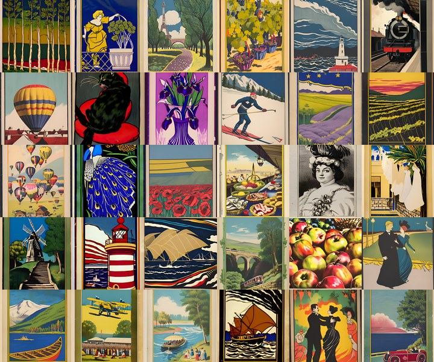

# Pagouro BE Gallery for Claude Code

A pane inside Claude Code that shows a Belle Époque poster every few seconds. Every picture was drawn by
[Pagouro BE](https://github.com/ericrwade/pagouro-be), a free image model that runs offline on a USB stick, trained only on
public-domain posters with a ledger for every one. The pictures are CC0: use them for anything.



## Install

```
claude plugin marketplace add ericrwade/pagouro-be-gallery
claude plugin install pagouro-be-gallery@pagouro
```

Then, in a Claude Code session:

```
/pagouro_be              open the gallery, one picture every 12 seconds
/pagouro_be 20           one every 20 seconds
/pagouro_be next         /pagouro_be prev      /pagouro_be pause      /pagouro_be play      /pagouro_be stop
```

Nothing to set up: thirty pictures ship inside the plugin. No network, no Python, no account.

## What it looks like, honestly

The pane draws each picture with colored text characters, not real pixels. Each character cell is an upper half block (▀):
its text color is one pixel and its background color is the pixel below it, so one character shows two pixels. A poster
comes out at roughly 60 by 60 pixels: a bold mosaic, recognizable from across the room, never sharp. The sheet above shows
what the pictures really look like.

- **Windows Terminal and the Claude Code desktop app on Windows: not ideal.** It works, but character cells there are large,
  so the mosaic is coarse, and there is no way to draw real pixels in a Windows terminal today. Make the pane as big as you
  can and shrink the font (Ctrl and minus) for a finer picture.
- **Mac and Linux:** the same mosaic; it looks finer in terminals with small, square-ish character cells (kitty, Ghostty,
  WezTerm, iTerm2).
- **Any terminal without 24-bit color** (old consoles, some SSH setups) will show wrong colors.

## Your own pictures

`tools/make_thumbs.py` turns a folder of PNG or JPG files into the thumbnails the plugin reads (needs Python and
Pillow):

```
python tools/make_thumbs.py "C:\path\to\pictures"
```

It writes a `thumbs` folder inside that folder. Then in Claude Code:

```
/pagouro_be folder C:\path\to\pictures\thumbs
/pagouro_be folder                       back to the bundled pictures
```

## What is in it

`plugins/pagouro-be-gallery/hooks/register.tsx` is the whole plugin (one file, about 170 lines), with a test beside it.
`plugins/pagouro-be-gallery/pictures/` holds the thirty thumbnails (raw RGB, base64 text) and `index.json` with each picture's caption, its
category and the seed it was drawn with. They were chosen from 180 showcase pictures (the ones a vision judge found free of
the garbled lettering Pagouro BE sometimes draws); the prompts, seeds and judge notes for all 180 are in
`showcase/x180/prompts.jsonl` of the Pagouro BE repository.

## License

Code: Apache 2.0. Pictures: CC0 1.0 (Pagouro BE's outputs carry no rights). Pagouro BE itself is CC BY-SA 4.0, a
fine-tune of CommonCanvas-S-C.

Eric Wade, with Claude (Anthropic). https://pagouro.com
